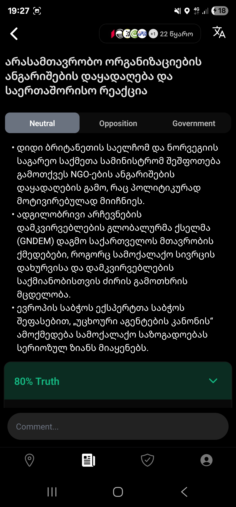
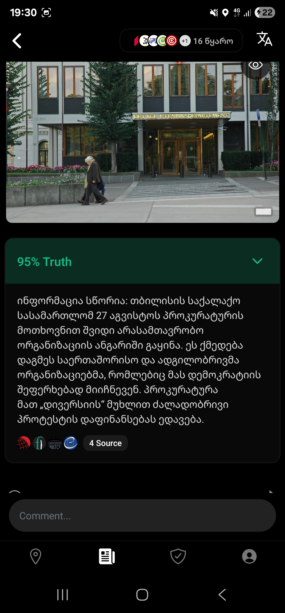
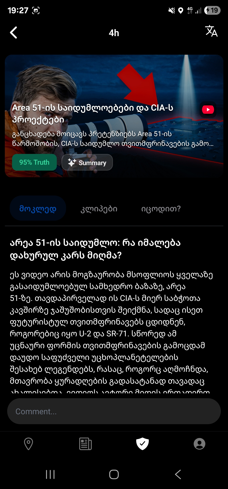

<h1 align="center">
  <a href="https://github.com/walofficial/wal-server">
    <!-- Please provide path to your logo here -->
    
  </a>
</h1>

<div align="center">
  WAL
  <br />
  <a href="#about"><strong>Explore the screenshots »</strong></a>
  <br />
  <br />
  <a href="https://github.com/walofficial/wal-server/issues/new?assignees=&labels=bug&template=01_BUG_REPORT.md&title=bug%3A+">Report a Bug</a>
  ·
  <a href="https://github.com/walofficial/wal-server/issues/new?assignees=&labels=enhancement&template=02_FEATURE_REQUEST.md&title=feat%3A+">Request a Feature</a>
  .
  <a href="https://github.com/walofficial/wal-server/issues/new?assignees=&labels=question&template=04_SUPPORT_QUESTION.md&title=support%3A+">Ask a Question</a>
</div>

<div align="center">
<br />

[](LICENSE)

[](https://github.com/walofficial/wal-server/issues?q=is%3Aissue+is%3Aopen+label%3A%22help+wanted%22)
[](https://github.com/nikasamadalashvili)
[](https://github.com/nshelia)

</div>

<details open="open">
<summary>Table of Contents</summary>

- [About](#about)
  - [Built With](#built-with)
- [Getting Started](#getting-started)
  - [Prerequisites](#prerequisites)
  - [Installation](#installation)
- [Usage](#usage)
- [Roadmap](#roadmap)
- [Support](#support)
- [Project assistance](#project-assistance)
- [Contributing](#contributing)
- [Authors & contributors](#authors--contributors)
- [Security](#security)
- [License](#license)
- [Acknowledgements](#acknowledgements)

</details>

---

## About

**WAL** is a comprehensive social media and news verification platform with advanced AI-powered fact-checking capabilities. The platform specializes in Georgian politics and news, providing real-time content analysis, live streaming, and community-driven verification of information.

### Core Purpose

WAL addresses the critical challenge of misinformation in the digital age by providing:

- **AI-powered fact-checking** using advanced language models and multi-source verification
- **Real-time news aggregation** from multiple Georgian news sources with bias analysis
- **Live streaming and verification** capabilities for citizen journalism
- **Social media content analysis** and verification
- **Community-driven content verification** with user engagement features

The platform serves as a trusted source for verified information, particularly focusing on Georgian political events and news, while providing tools for users to contribute to the verification process through live streaming, photo/video uploads, and community discussions.

<details>
<summary>Screenshots</summary>
<br>

<div align="center">
  <table>
    <tr>
      <td width="33.33%" align="center"><strong>News Details</strong></td>
      <td width="33.33%" align="center"><strong>Fact Checking</strong></td>
      <td width="33.33%" align="center"><strong>Video Summary</strong></td>
    </tr>
    <tr>
      <td width="33.33%"></td>
      <td width="33.33%"></td>
      <td width="33.33%"></td>
    </tr>
  </table>
</div>

</details>

### Built With

**Backend Technologies:**

- **Python 3.13** - Core programming language
- **FastAPI** - Modern, high-performance web framework for APIs
- **MongoDB** - Primary database for storing user data, posts, and verification results
- **Redis** - Caching and session management
- **Socket.IO** - Real-time communication for chat and live features

**AI & Machine Learning:**

- **Google Gemini AI** - Advanced language model for content analysis and fact-checking
- **Langfuse** - LLM observability and monitoring
- **OpenAI API** - Additional AI capabilities
- **Jina AI** - Document processing and embeddings

**Media Processing:**

- **LiveKit** - Real-time video streaming and RTMP ingress
- **FFmpeg** - Video/audio processing and transcoding
- **Google Cloud Video Transcoder** - Professional video processing
- **Google Cloud Speech-to-Text** - Audio transcription

**Cloud Infrastructure:**

- **Google Cloud Platform (GCP)** - Primary cloud provider
- **Google Cloud Storage** - File and media storage
- **Google Cloud Pub/Sub** - Asynchronous message processing
- **Google Cloud Tasks** - Background job processing
- **Google Cloud Vision** - Image analysis and OCR

**Development & Deployment:**

- **Docker** - Containerization and deployment
- **uv** - Fast Python package installer and dependency manager
- **Gunicorn** - WSGI HTTP server for production
- **Uvicorn** - ASGI server for development

**External Integrations:**

- **Supabase** - Authentication and user management
- **Twilio** - SMS and communication services
- **Google Maps API** - Location services
- **Various news APIs** - Content aggregation from Georgian news sources

## Getting Started

### Prerequisites

Before setting up WAL, ensure you have the following installed:

**Required Software:**

- **Docker** and **Docker Compose** - For containerized deployment
- **Python 3.13+** - If running without Docker
- **uv** - Python package manager (for local development)
- **Git** - For version control

**Required Services & API Keys:**

- **Google Cloud Platform (GCP) Account** with the following APIs enabled:
  - Cloud Storage API
  - Cloud Pub/Sub API
  - Cloud Tasks API
  - Cloud Video Transcoder API
  - Cloud Speech-to-Text API
  - Cloud Vision API
  - Gemini AI API
- **MongoDB** instance (local or cloud)
- **Redis** instance (local or cloud)
- **LiveKit** server instance
- **Supabase** project for authentication
- **Langfuse** account for AI observability

**Optional Services:**

- **Twilio** account for SMS functionality
- **OpenAI** API key for additional AI features
- **Jina AI** API key for document processing

### Installation

#### Option 1: Docker Compose (Recommended)

**For Local Development with Full Stack:**

1. **Clone the repository:**

   ```bash
   git clone https://github.com/walofficial/wal-server.git
   cd wal-server
   ```

2. **Set up environment configuration:**

   ```bash
   # Create config directory if it doesn't exist
   mkdir -p config

   # Create your environment files
   cp config/.env.example config/.env
   cp config/local.env.example config/local.env
   ```

3. **Configure environment variables:**
   Edit `config/.env` and `config/local.env` with your API keys and service configurations.

4. **Set up Google Cloud credentials:**

   ```bash
   # Authenticate with Google Cloud
   gcloud auth application-default login
   ```

5. **Run the full development stack:**
   ```bash
   docker-compose -f docker-compose.local.yml up --build
   ```

**For Production-like Environment:**

```bash
# Using the main docker-compose file
docker-compose up --build -d
```

**For Debug Mode:**

```bash
# Run with debugging enabled
docker-compose -f docker-compose.debug.yml up --build
```

#### Option 2: Local Python Development

1. **Install uv (Python package manager):**

   ```bash
   curl -LsSf https://astral.sh/uv/install.sh | sh
   ```

2. **Clone and setup:**

   ```bash
   git clone https://github.com/walofficial/wal-server.git
   cd wal-server

   # Install dependencies
   uv sync

   # Activate virtual environment
   source .venv/bin/activate  # On Windows: .venv\Scripts\activate
   ```

3. **Set up external services:**

   - Start MongoDB (locally or use cloud instance)
   - Start Redis (locally or use cloud instance)
   - Configure all required API keys in environment files

4. **Run the application:**

   ```bash
   # Development mode
   uvicorn ment_api.app:app --host 0.0.0.0 --port 8000 --reload

   # Or using the main script
   python src/main.py
   ```

#### Service URLs (Local Development)

After successful setup, the following services will be available:

- **WAL API**: http://localhost:5500
- **MongoDB**: localhost:27017
- **Redis**: localhost:6379
- **Google Pub/Sub Emulator**: localhost:8085
- **Google Cloud Storage Emulator**: localhost:4443
- **Google Cloud Tasks Emulator**: localhost:8123

## Usage

### API Documentation

Once the application is running, you can access the interactive API documentation:

- **Swagger UI**: http://localhost:5500/docs
- **ReDoc**: http://localhost:5500/redoc

### Core API Features

#### 🔐 Authentication & User Management

- **User Registration & Profile Management** - Create and manage user accounts with Supabase authentication
- **Profile Information** - Get user profiles, statistics, and verification status
- **Friend System** - Send/accept friend requests and manage social connections

#### 📸 Content Verification & Fact-Checking

- **Photo Verification** - Upload images with automatic AI analysis and fact-checking
- **Video Processing** - Upload videos with transcription, summary generation, and verification
- **Social Media Scraping** - Analyze and verify content from social media platforms
- **AI-Powered Analysis** - Advanced content analysis with importance scoring (0-100 scale)

#### 📺 Live Streaming & Real-time Features

- **Live Stream Creation** - Start live streams with automatic recording
- **RTMP Ingress** - Professional streaming support for OBS, DJI drones, and mobile apps
- **Real-time Chat** - WebSocket-based messaging with Socket.IO
- **Live User Actions** - Real-time interactions like pokes and live reactions

#### 📰 News & Content Discovery

- **Location-based Feeds** - Get content filtered by geographic location
- **Mixed Content Feeds** - Personalized content streams with pagination
- **News Aggregation** - Automated news collection from Georgian sources
- **Multi-language Support** - Content available in Georgian and English

#### 💬 Community Features

- **Comments System** - Add comments with AI analysis and tagging
- **Reactions & Likes** - React to content with various emotion types
- **Notifications** - Real-time push notifications for user interactions
- **Space Management** - Create and manage community spaces

#### 🔍 Advanced Features

- **GeoIP Detection** - Automatic country detection for content localization
- **Health Monitoring** - Built-in health checks and system monitoring
- **Translation Services** - Automatic content translation between supported languages
- **Content Moderation** - AI-powered content analysis and moderation tools

#### 🌐 WebSocket Real-time Communication

- **Socket.IO Integration** - Real-time bidirectional communication between client and server
- **Room Management** - Join and leave chat rooms dynamically
- **Message Broadcasting** - Send messages to specific users or rooms
- **Live Updates** - Real-time feed updates and user presence tracking
- **Event Handling** - Custom events for live reactions, notifications, and status changes

### Key Use Cases

1. **Citizen Journalism**: Users can upload photos/videos from events and get AI-powered verification
2. **News Verification**: Automatic fact-checking of news articles from Georgian sources
3. **Live Event Coverage**: Real-time streaming with RTMP support for professional equipment
4. **Community Discussion**: Chat and comment systems for community engagement
5. **Content Moderation**: AI-powered analysis of user-generated content
6. **Multi-language Support**: Content available in Georgian and English with automatic translation

## Roadmap

See the [open issues](https://github.com/walofficial/wal-server/issues) for a list of proposed features (and known issues).

- [Top Feature Requests](https://github.com/walofficial/wal-server/issues?q=label%3Aenhancement+is%3Aopen+sort%3Areactions-%2B1-desc) (Add your votes using the 👍 reaction)
- [Top Bugs](https://github.com/walofficial/wal-server/issues?q=is%3Aissue+is%3Aopen+label%3Abug+sort%3Areactions-%2B1-desc) (Add your votes using the 👍 reaction)
- [Newest Bugs](https://github.com/walofficial/wal-server/issues?q=is%3Aopen+is%3Aissue+label%3Abug)

## Support

### Getting Help

For support and assistance with WAL:

Reach out to the maintainer at one of the following places:

- [GitHub issues](https://github.com/walofficial/wal-server/issues/new?assignees=&labels=question&template=04_SUPPORT_QUESTION.md&title=support%3A+)
- Contact options listed on [this GitHub profile](https://github.com/nikasamadalashvili)

## Project assistance

If you want to say **thank you** or/and support active development of WAL:

- Add a [GitHub Star](https://github.com/walofficial/wal-server) to the project.
- Tweet about the WAL.

Together, we can make WAL **better**!

## Contributing

First off, thanks for taking the time to contribute! Contributions are what make the open-source community such an amazing place to learn, inspire, and create. Any contributions you make will benefit everybody else and are **greatly appreciated**.

Please read [our contribution guidelines](docs/CONTRIBUTING.md), and thank you for being involved!

## Authors & contributors

**Authors:**

- [Nika Samadalashvili](https://github.com/nikasamadalashvili) - Original setup and development
- [nshelia](https://github.com/nshelia) - Original setup and development

For a full list of all authors and contributors, see [the contributors page](https://github.com/walofficial/wal-server/contributors).

## Security

_For more information and to report security issues, please refer to our [security documentation](docs/SECURITY.md)._

## License

This project is licensed under the **Apache Software License 2.0**.

See [LICENSE](LICENSE) for more information.

## Acknowledgements

### Technology Partners

WAL is built with and relies on several outstanding technologies and services:

- **Google Cloud Platform** - For comprehensive cloud infrastructure and AI services
- **LiveKit** - For real-time video streaming capabilities
- **Supabase** - For authentication and database services
- **MongoDB** - For flexible document storage
- **FastAPI** - For high-performance API development
- **Langfuse** - For AI observability and monitoring

### Open Source Libraries

Special thanks to the maintainers and contributors of the numerous open-source libraries that make WAL possible, including but not limited to:

- **Python ecosystem** - pandas, numpy, aiohttp, pydantic, and many others
- **AI/ML libraries** - OpenAI, Google AI, and related tools
- **Media processing** - FFmpeg, LiveKit, and video processing tools
- **Development tools** - uv, Docker, and the entire Python development ecosystem

### Community

Thanks to the Georgian tech community and all contributors who help make information verification and fact-checking more accessible and reliable.
